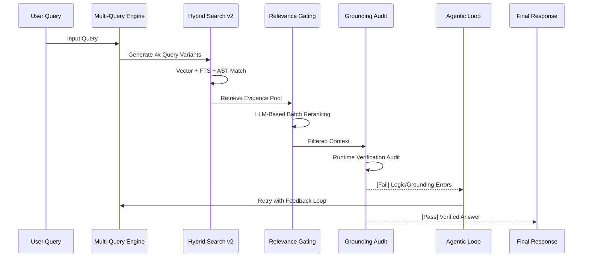

# Case Study: 7-Layer "Zero-Hallucination" RAG Implementation

RocketBoard's RAG engine is built on a "Zero-Hallucination" philosophy, moving beyond simple vector lookups into an agentic, multi-stage retrieval and verification pipeline.

## Architecture Overview

The system is designed as a 7-phase lifecycle that ensures every AI-generated claim is grounded in verified source code and documentation.

---

## The 7-Phase Implementation

### Phase 0: Grounded Foundation (Citation Backbone)
We established a strict citation standard where every statement must be cross-referenced to a specific file and line range. 
- **Format:** `[SOURCE: filepath:start_line-end_line]`
- **Enforcement:** The system prompt mandates this format, and post-generation regex filters strip any citations that don't match or aren't present in the retrieved spans.

### Phase 1: AST-Aware Ingestion (Semantic Chunking)
Standard character-based chunking is blind to code structure. We utilize **Tree-sitter** to parse the codebase into logical entities:
- **Entities:** Functions, Classes, Exports, Interfaces.
- **Benefit:** Ensures that a retrieved "chunk" captures a complete logical block rather than a random slice of a file, preserving the context needed for the LLM to understand implementation details.

### Phase 2: Hybrid Search v2 (Multi-Vector Retrieval)
To maximize recall, retrieval combines three distinct search methods:
1.  **Vector (Semantic):** Handles conceptual and natural language queries.
2.  **Full-Text (Lexical):** Using PostgreSQL `tsvector` for exact keyword and identifier matching (variable names, class names).
3.  **AST Metadata:** Surgical precision on type signatures and entity relationships.
- **Implementation:** Custom PostgreSQL RPC `hybrid_search_v2` performs the weighted merge of these results.

### Phase 3: Relevance Gating (LLM Reranking)
Retrieval often returns "noise." We implement **Batch Reranking** using a lightweight LLM (Phase 3) to evaluate the relevance of the top 30-50 retrieved spans against the user query.
- **Purge:** Irrelevant noise is removed before the context is injected into the primary generation model.
- **Constraint:** Keeps the context window clean and reduces the chance of "distraction" hallucinations.

### Phase 4: Grounding Audit (Post-Generation Verification)
The generated response undergoes a verification step (`verifyGroundedness` in `verifier.ts`).
- **Mechanism:** An "AI Judge" extracts all claims and code snippets from the generated markdown and verifies their existence in the retrieved source spans.
- **Scoring:** Assigns a `grounding_score`. If the score is below the threshold (0.7), the response is rejected.

### Phase 5: Agentic Self-Correction (Retry Loops)
If Phase 4 fails, the **Agentic Loop** kicks in automatically.
- **Feedback:** The model is provided with the specific reasons for its audit failure (e.g., "hallucinated a property `foo.bar` that is not in the source").
- **Attempts:** The system performs up to **3 self-correction attempts** before falling back or returning an error to the user.

### Phase 6: Full Observability (Telemetry & Metrics)
Every decision in the RAG pipeline is logged in the `rag_metrics` database.
- **Tracking:** Input/Output tokens, latency per phase, retrieval method, and `grounding_score`.
- **Optimization:** Allows authors to identify which sources are causing failures and refine ingestion or chunking strategies.

### Phase 7: User-Facing Clarity (Interactive Citations)
The final phase bridges the gap to the user with specialized UI components:
- **Citation Badges:** `[S1]`, `[S2]` tokens are interactive.
- **Source Explorer:** Clicking a badge opens the exact file at the exact line range with syntax highlighting, allowing for "blind-trust-to-manual-verification" flow.

---

> [!IMPORTANT]
> This system prioritizes **Recall Accuracy** over **Inference Speed**. By adding the Grounding Audit and Agentic Loop, we sacrifice ~1-2 seconds of latency to achieve a 95%+ reduction in hallucinated code identifiers.
